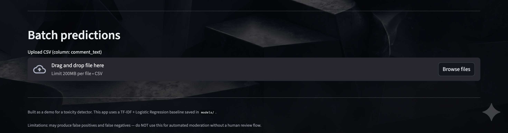

# Toxicity Detector

Interactive Streamlit app for toxic comment detection with:
- a baseline `TF-IDF + Logistic Regression` model
- optional local/Hugging Face `unitary/toxic-bert` inference
- token-level contribution explanations
- batch CSV scoring with moderation actions

## Overview

This project trains and serves a binary toxicity detector using the Jigsaw Toxic Comment dataset.

The app supports:
- **Single-text inference** with probability and label
- **Action recommendation** (`AUTO-HIDE`, `FLAG FOR REVIEW`, `NO ACTION`)
- **Token attribution**:
  - TF-IDF coefficient-based explanation for baseline model
  - Integrated-gradients style attribution for BERT mode
- **Batch predictions** from uploaded CSV files containing `comment_text`

## Features

- Real-time toxicity scoring in Streamlit
- Selectable inference model:
  - `TF-IDF Baseline` (default)
  - `BERT (unitary/toxic-bert)` when available
  - optional embeddings model if `models/embeddings_clf.joblib` exists
- Adjustable moderation threshold slider
- Downloadable batch prediction output CSV
- Automatic baseline training in app startup **if model files are missing** and training data is available

## Visuals

- Front page view


- Toxicity detection page


- Custom CSV based model training


## Dataset

- **Source:** Jigsaw Toxic Comment Classification Challenge (Kaggle)
- **Raw input expected at:** `data/raw/train.csv`

The preprocessing step builds:
- cleaned text (`comment_clean`)
- metadata (`char_len`, `word_count`)
- binary target (`target` = any toxicity label > 0)
- output parquet at `data/processed/train_clean.parquet`

## Tech Stack

- Python
- Streamlit
- pandas, numpy
- scikit-learn
- joblib
- tqdm
- transformers, torch (for BERT mode)

## Project Structure

```text
Classifier/
├── streamlit_toxicity_app.py
├── requirements.txt
├── Readme.md
├── src/
│   ├── data_prep.py
│   ├── train_baseline.py
│   └── quickmanualinterferencetest.py
├── models/
│   ├── tfidf.joblib
│   ├── baseline_lr.joblib
│   ├── baseline_nb.joblib
│   ├── baseline_svm.joblib
│   ├── val_preds.csv
│   └── toxic-bert/
│       ├── config.json
│       ├── model.safetensors
│       ├── tokenizer.json
│       └── tokenizer_config.json
└── data/
    ├── raw/
    │   └── train.csv
    └── processed/
        └── train_clean.parquet
```

## Setup and Run

### 1) Install dependencies

```bash
pip install -r requirements.txt
```

### 2) Prepare data

```bash
python src/data_prep.py 
```

### 3) Train baseline model

```bash
python src/train_baseline.py 
```

This saves:
- `models/tfidf.joblib`
- `models/baseline_lr.joblib`
- `models/val_preds.csv`

### 4) Start the app

```bash
python -m streamlit run streamlit_toxicity_app.py
```

## Batch Prediction Format

Upload a CSV containing:
- `comment_text`

The app adds:
- `toxicity_proba`
- `action` (`AUTO-HIDE` / `REVIEW` / `NO_ACTION`)

## Notes

- If baseline artifacts are missing, the app tries to run `src/train_baseline.py` automatically.
- Automatic training requires processed data at `data/processed/train_clean.parquet`.
- BERT mode loads from:
  1. local folder `models/toxic-bert` (preferred), or
  2. Hugging Face model `unitary/toxic-bert`
- This is a demo/portfolio project. Do not use as a fully automated moderation system without human review.

